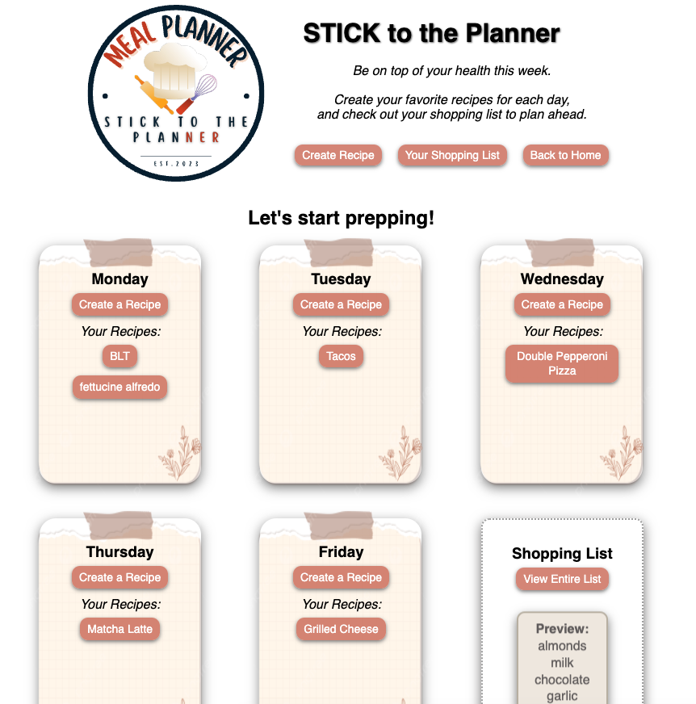
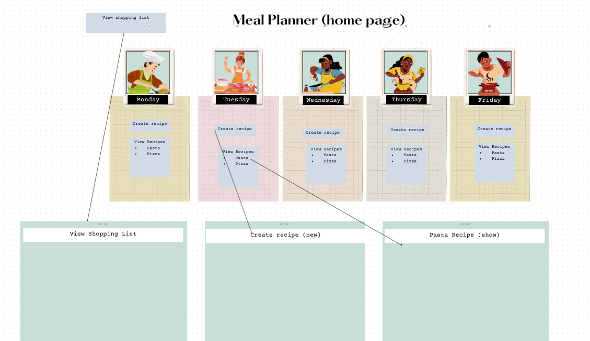
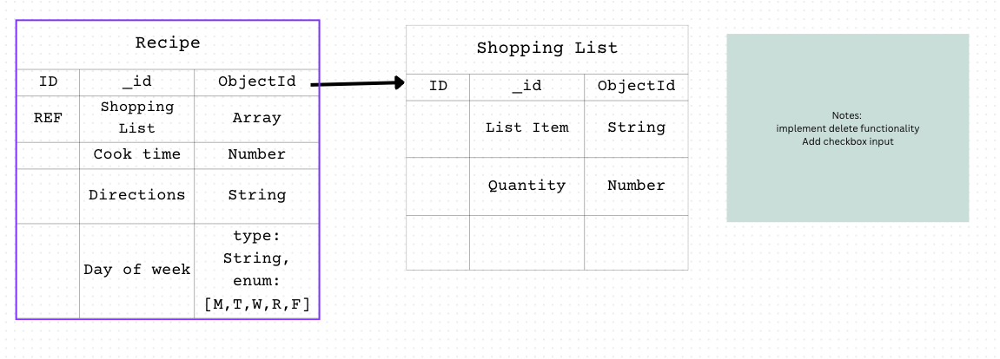

# App Title: &#127858; Weekly Meal Planner &#128466;&#65039; (Full-stack CRUD Application)
## Intro :

Meal planning can be a pain, especially on a busy schedule. We wanted to build a weekly planner application that would give the user some organizational assistance. You will find a page to create recipes, a page to view and update the recipes, as well as a shopping list page to view any ingredients the user may need to grab for the week. This is only the beginning of the journey to making this application more user friendly and functional for everyday life. Checkout our icebox features that we hope to add in the future. 

## Landing Page & WireFrame:

Full-stack CRUD Application

WireFrame

ERD

## Technologies Used

Express JS, Node.JS, Mongoose, MongoDB, JavaScript, CSS, HTML(EJS), Heroku

## Getting Started &#129368;:

Our Trello Board:
<https://trello.com/b/HsQOPxp7>

Our App:
<https://best-meal-planner.herokuapp.com/>

This application can be used to create and store your favorite recipes. You can plan out your week by adding the recipe for the day you desire. You can also edit your recipe to make any changes needed. Each ingredient you add will automatically be added to your shopping list. In your shopping list you can delete items you may already have on hand. I hope you enjoy it!

### Next Steps (Ice-box) &#129482;: 

Furture Plans & Enhancements:

-Breakfast lunch & dinner recipes

-Create recipes for the whole week instead just the weekday (M-F)

-Add a family vote for the meals

-Add a review page for each recipe

-Use API for recipes list

-Implement budget for shopping list

-Add side dishes to each entree

-Add log-in capabilities (Oauth)

-Add links to favorite recipes or videos

### Collaborative Efforts by:

#### Gabi D &#9749; &
#### Steph N &#127861;

